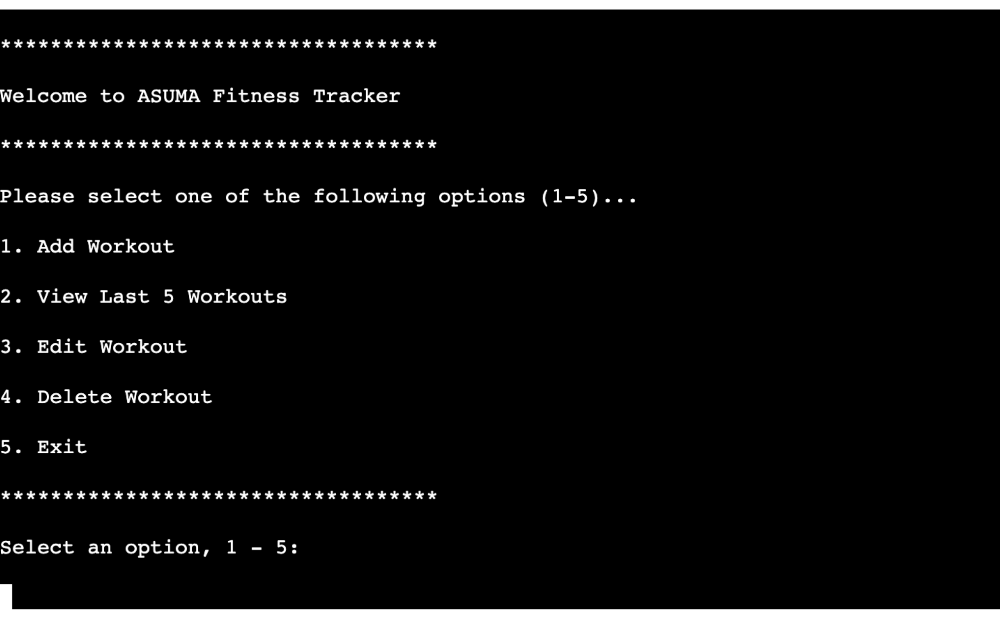
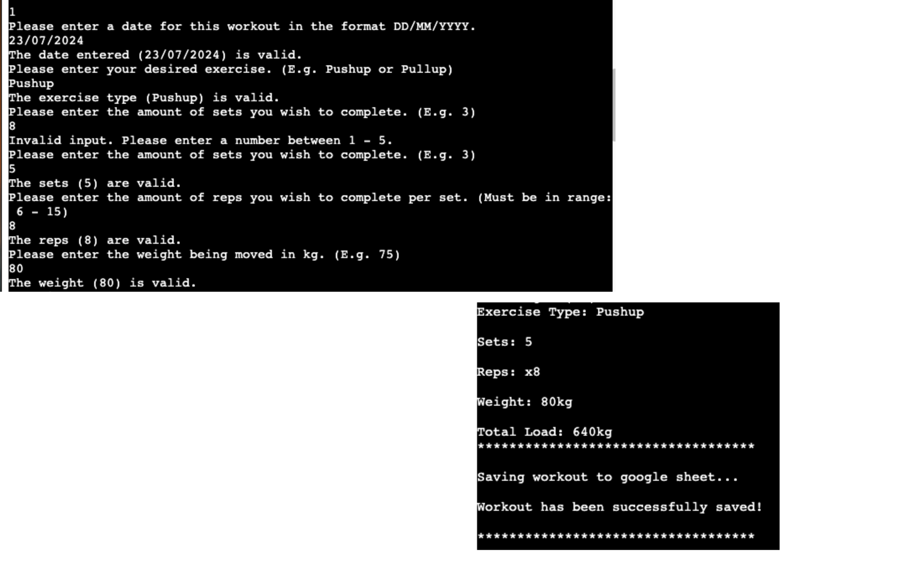
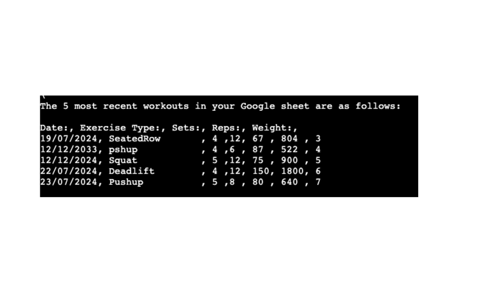
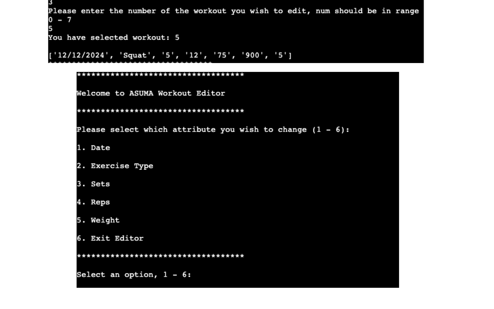
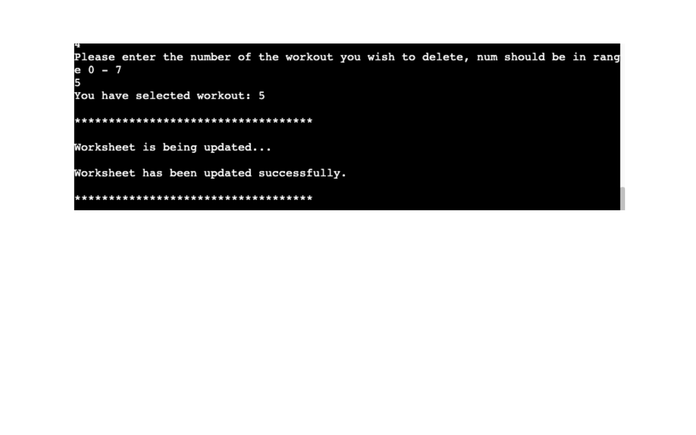
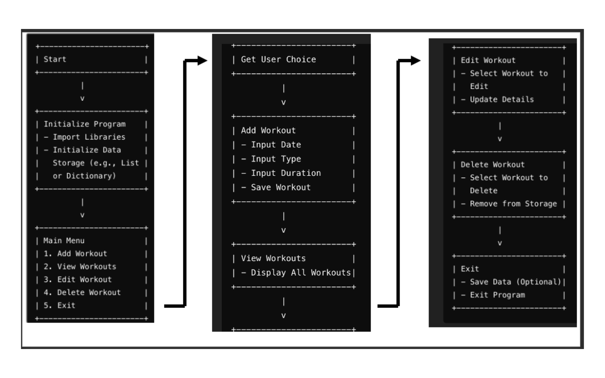

# ASUMA Workout Tracker

This program will help you track and achieve your fitness goals!
You can adapt the program so that the fitness goals set are feasible to you.

Click here for the deployed version on Heroku:

- [ASUMA-Workout-Tracker](https://workout-tracker-jack-42e974a77ce1.herokuapp.com/)

## Software Requirements

The following version of Python:

- Python 3.12.2

The following libraries need to be installed to run the program:

- gspread 6.0.0

## Data Requirements

Click here to view the Google Sheet that this program interacts with (READ-ONLY):
[Google-Sheet](https://docs.google.com/spreadsheets/d/13rgsJFhYq0VwH3gN1QA4ypih4yXAEgpVPMw8qzo1Fi8/edit?usp=sharing)

## User Stories

### First Time Visitor

- I want to understand the purpose of the program
- I want to be able to directly and accrurately set out my fitness goals
- I want clear and concise instructions on how to run aspects of the program

### Frequent Visitor

- I want to set more goals/ workouts easily
- I want to view the result
- I want to be able to edit and remove specific workouts

## User Guide

1. When starting the program the user will be presented with a welcome message and a menu with 5 options to choose from.

2. When clicking on the `1. Add Workout` option, the program prompts you to answer a few questions relating to the workout you wish to add. Once all values have been entered, they get sent off and stored into the Google Sheet linked at the top of this README.md file. Below are the questions you should expect to answer

3. When clicking on the `2. View Last 5 Workouts` option, the program gathers the 5 most recent workouts that have been updated to the Google Worksheet and prints the data as a table to the terminal with their respective headings above.

4. When clicking on the `3. Edit Workout` option, the program requests which workout it is you wish to edit (including a range of numbers you should choose from). Once the workout has been chosen, you are taken to a welcome screen in which it prompts you to choose an attribute you wish to edit, all data that has been edited in the program will be updated also on the Google sheet.

5. When clicking on the `4. Delete Workout` option, the program, again, requests which workout it is you wish to delete and removes it from the Google sheet.

6. Finally, when clicking on the `5. Exit` option, the program ends and needs to be restarted.

## Flowchart

The logic of the program can be seen in the presented flow chart:

## Technologies Used

### Languages

- [Python 3.12.2:](https://www.python.org/downloads/release/python-3122/) For the logic of the program and the output to the terminal.
- [Javascript:](https://www.javascript.com/) To run the script needed for the Code Institute mock terminal
- [HTML:](https://developer.mozilla.org/en-US/docs/Web/HTML) For the construction of the provided Code Institute mock terminal

### Python Libraries

- [gspread](https://docs.gspread.org/en/v6.0.1/) to import `gspread` to allow the program to send data to the Google worksheet.
- [datetime](https://docs.python.org/3/library/datetime.html) to import `datetime` so that the dates of each workout can be validated.

### Tools

- [Gitpod](https://www.gitpod.io/) for writing and editing the code
- [Git](https://git-scm.com/) for the version control of the program
- [GitHub](https://github.com/) for hosting the code of the program
- [Heroku](https://dashboard.heroku.com/) for deploying the program
- [Canva](https://www.canva.com/) for editing the images for this README
- [ChatGPT](https://chatgpt.com/) for creating a flow chart of the program

## Bugs

### Fixed Bugs

- _Bug 1:_
  Whilst testing many functions containing a while loop and an input, I encountered numerous infinite loops being produced in the terminal.
  _Solution:_
  The input variable needed to be inside of the while loop. The infinite loop was caused due to the loop condition not being updated with the new input values, hence, the exit condition can never be met.

- _Bug 2:_
  In the user_choice() and edit_workout() functions, they both originally contained a huge block of if-else statements. I noticed that the performance of the program was being affected by this.
  \_Solution:\*
  I replaced this block with a match-case scenario and this caused the performance to drastically improve. This is because the program only runs the code that has been requested by the user, rather than running it all beforehand.

- _Bug 3:_
  In the edit_workout() function I encountered an issue in trying to access the correct cell of data to be edited.
  \_Solution:\*
  The reason for this was a TypeError, where the index being entered was interpreted as a string, hence, in the code I have converted the input value to an integer to defeat this error.

  ## Testing

  Please go to the [TESTING.md](TESTING.md) file for the documentation of the project.

  ## Deployment

  ### Heroku

  The program was deployed to Heroku and can be found [here](https://workout-tracker-jack-42e974a77ce1.herokuapp.com/).

  To deploy the project, the following steps need to be taken:

- Create a new [GitHub](https://github.com/) repository.
- Open the new repository in your editor (Gitpod, VSCode, etc.)
- Clone this repository using the following git command:
  - `https://github.com/JackSummerfield1/workout-tracker.git`
- Push the cloned version to GitHub using `git push`
- Log in to your [Heroku](https://dashboard.heroku.com/) account or create a new one
- Go to your dashboard, click on new and choose the option `Create new app`
- After creating the app click on `Deploy` in the menu
- Click on GitHub as `Deployment method`
- Link your GitHub account and choose the newly created repository
- Now click on `Settings` and click on `Reveal Config Vars`
- Enter for `Key` the text `PORT` and for `Value` the number `8000`
- Enter for another `Key` the text `CREDS` and for `Value` the private info in the creds.json file
- Click on `Add buildpack` and add the following build packs in the exact order:
  - heroku/python
  - heroku/nodejs
- Go back to the tab `Deploy` and scroll to the bottom of the page to click on `Deploy Branch`
- After completing the deployment process, click on `View`

### Gitpod

To run the program on Gitpod locally, go through the following steps:

- Open Gitpod
- Clone this repository using the following git command:
  - `https://github.com/JackSummerfield1/workout-tracker.git`
- Install the needed libraries using the following pip command:
  - `pip install -r requirements.txt`
  - `pip install gspread`
- Start the program in the terminal using the following command:
  - `python3 run.py`

## Credits

The following sources have helped me a ton whilst creating this project, these have also been commented into the code where they have been used.

- For validating the date entries:
  Credit to Max O'Didily with help on this:
  [Max O'Didily YT Video](https://www.youtube.com/watch?v=5n_JagFqWeg)
- For improving the if-else scenario to a match-case:
  Credit to:
  [Free Code Camp](https://www.freecodecamp.org/news/python-switch-statement-switch-case-example/)
- For creating the flow chart for the program:
  [ChatGPT](https://chatgpt.com/)
- Credit to Code Institute helping with the use of an API for the google worksheet and linking my program to the external source.

## Acknowledgements

- I want to thank my mentor, Rory Patrick S, for his incredible guidance and support throughtout this process.
- Many thanks to [Code Institute](https://codeinstitute.net/) for providing the learning content and the used mock terminal.
