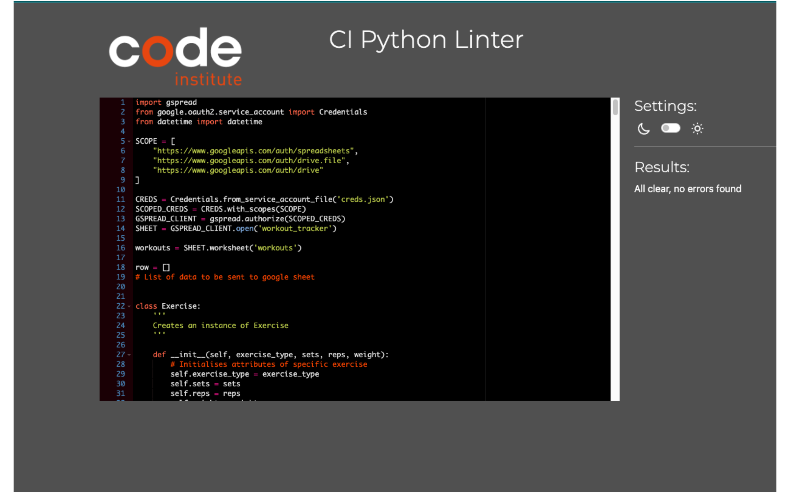

Click on the following link to get back to the [README.md](README.md).

## Testing

Each function was rigorously tested during development to ensure it is now fully operational and working as intended. Also, the code was passed through the Code Institute [PEP8 CI Python Linter](https://pep8ci.herokuapp.com/)

### Validator Testing

Here is the result of the PEP8 validator testing:

Here is the end of the code with an empty line following to prove the entirety of the code was passed through the validator:

### Manual Testing

To ensure the program is completely working as intended, I also tested the deployed project on Heroku. It can be found [here](https://workout-tracker-jack-42e974a77ce1.herokuapp.com/).
I worked my way through each and every possible option and have tested all functionalities are working as expected and have listed them down below:

#### Functionality Test

| Action                              | Expected Result                                                                                                                                                         | Did it work? | Notes                                                                    |
| ----------------------------------- | ----------------------------------------------------------------------------------------------------------------------------------------------------------------------- | ------------ | ------------------------------------------------------------------------ |
| Enter '1'                           | Asks for a date                                                                                                                                                         | Yes          | -----                                                                    |
| Enter valid date                    | Feedback + asks for an exercise type                                                                                                                                    | Yes          | -----                                                                    |
| Enter valid exercise type           | Feedback + asks for sets                                                                                                                                                | Yes          | -----                                                                    |
| Enter valid sets                    | Feedback + asks for reps                                                                                                                                                | Yes          | -----                                                                    |
| Enter valid reps                    | Feedback + asks for weight                                                                                                                                              | Yes          | -----                                                                    |
| Enter valid weight                  | Feedback + calculates total load, prints it to terminal and saves to google sheet                                                                                       | Yes          | -----                                                                    |
| Enter '2'                           | Displays 5 most recent workouts from google sheet                                                                                                                       | Yes          | -----                                                                    |
| Enter '3'                           | Asks for the number of the workout the user wishes to edit                                                                                                              | Yes          | -----                                                                    |
| Enter workout number                | Prints the workout to be edited to the terminal and greets the user with an editor welcome screen, prompting the user to pick a number 1-6 on which attribute to change | Yes          | -----                                                                    |
| Enter '1' to edit the date          | Asks the user to input a valid date and then loops back to see if they want to edit any other attributes                                                                | Yes          | -----                                                                    |
| Enter '2' to edit the exercise type | Asks the user to input a valid exercise type and then loops back to see if they want to edit any other attributes                                                       | Yes          | -----                                                                    |
| Enter '3' to edit the sets          | Asks the user to input a valid amount of sets and then loops back to see if they want to edit any other attributes                                                      | Yes          | -----                                                                    |
| Enter '4' to edit the reps          | Asks the user to input a valid amount of reps and then loops back to see if they want to edit any other attributes                                                      | Yes          | -----                                                                    |
| Enter '5' to edit the weight        | Asks the user to input a valid weight and then loops back to see if they want to edit any other attributes                                                              | Yes          | -----                                                                    |
| Enter '6' to exit the editor        | Greets the user with the original welcome screen again and asks them if they want to do anything else.                                                                  | Yes          | -----                                                                    |
| Enter '4' to delete a workout       | Asks the user which workout they wish to delete                                                                                                                         | Yes          | -----                                                                    |
| Enter a valid workout number        | Greets the user with a message saying successfully deleted and asks if they want to proceed with anything else                                                          | Yes          | -----                                                                    |
| Enter '5' to exit                   | Stops the program                                                                                                                                                       | Yes          | To restart or reload the program press 'Run Program' or refresh the page |

#### User Input Validation

| Problem                          | What should happen?                                                                      | Did it work? |
| -------------------------------- | ---------------------------------------------------------------------------------------- | ------------ |
| User presses enter without input | Loops the input until the correct value is entered                                       | Yes          |
| Wrong date format                | Show custom error message and ensure the user inputs the date in the correct format      | Yes          |
| TypeError                        | Show custom error message if an integer is entered for an alpha only input or vice versa | Yes          |
